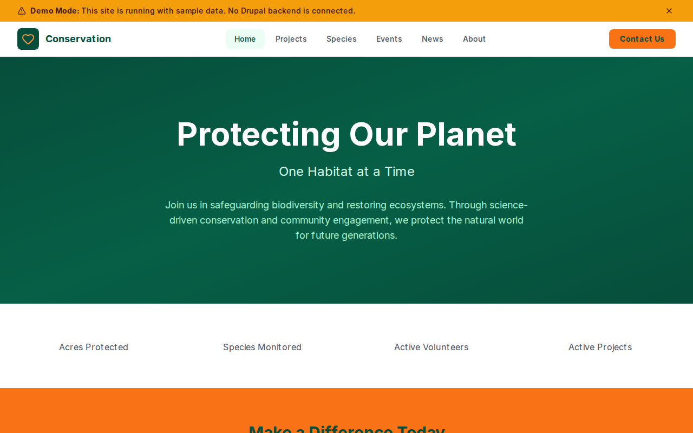

# Decoupled Conservation

A conservation organization website starter template for Decoupled Drupal + Next.js. Built for wildlife conservation societies, environmental nonprofits, and habitat preservation organizations.



## Features

- **Conservation Projects** - Habitat restoration, wildlife corridors, marine reserves, and reforestation initiatives with goals, progress, and volunteer opportunities
- **Species Profiles** - Endangered and protected species with conservation status, population data, habitat info, and threat assessments
- **Conservation Events** - Volunteer days, fundraisers, workshops, and educational programs with registration and location details
- **Conservation News** - Research updates, field reports, community stories, and press releases
- **Modern Design** - Clean, accessible UI optimized for conservation and environmental content

## Quick Start

### 1. Clone the template

```bash
npx degit nextagencyio/decoupled-conservation my-conservation-org
cd my-conservation-org
npm install
```

### 2. Run interactive setup

```bash
npm run setup
```

This interactive script will:
- Authenticate with Decoupled.io (opens browser)
- Create a new Drupal space
- Wait for provisioning (~90 seconds)
- Configure your `.env.local` file
- Import sample content

### 3. Start development

```bash
npm run dev
```

Visit [http://localhost:3000](http://localhost:3000)

---

## Manual Setup

<details>
<summary>Click to expand manual setup steps</summary>

### Authenticate with Decoupled.io

```bash
npx decoupled-cli@latest auth login
```

### Create a Drupal space

```bash
npx decoupled-cli@latest spaces create "My Conservation Organization"
```

Note the space ID returned. Wait ~90 seconds for provisioning.

### Configure environment

```bash
npx decoupled-cli@latest spaces env 1234 --write .env.local
```

### Import content

```bash
npm run setup-content
```

This imports:
- Homepage with conservation statistics and call to action
- 4 Conservation Projects (River Restoration, Wildlife Corridor, Marine Reserve, Reforestation)
- 4 Species Profiles (Gray Wolf, Monarch Butterfly, Coral Reef, Red-cockaded Woodpecker)
- 3 Conservation Events (Volunteer Day, Fundraiser Gala, Nature Workshop)
- 3 News Articles (Research findings, community impact, field updates)
- 2 Static Pages (About, Get Involved)

</details>

## Content Types

### Conservation Project
- **Project Area** - Habitat Restoration, Wildlife Protection, Marine Conservation
- **Project Goals** - Conservation targets and milestones
- **Progress / Timeline** - Current status and completion estimates
- **Location** - Geographic area of the project
- **Volunteer Opportunities** - Ways to get involved
- **Project Image** - Photo from the project site

### Species Profile
- **Conservation Status** - Least Concern, Vulnerable, Endangered, Critically Endangered
- **Population Estimate** - Current known population numbers
- **Habitat** - Primary habitat type and range
- **Threats** - Key threats to the species
- **Conservation Actions** - Ongoing protection efforts
- **Species Image** - Photo of the species

### Conservation Event
- **Event Date / End Date** - Event timing
- **Location** - Where the event takes place
- **Event Type** - Volunteer, Fundraiser, Workshop
- **Registration URL** - Link to sign up
- **Cost** - Admission price or free
- **Event Image** - Promotional photo

### News
- **News Category** - Research, Announcements, Community
- **Publish Date** - When the article was published
- **Author** - Writer or department
- **Summary** - Brief excerpt
- **Featured Image** - Article image

## Customization

### Colors & Branding
Edit `tailwind.config.js` to customize colors, fonts, and spacing.

### Content Structure
Modify `data/conservation-content.json` to add or change content types and sample content.

### Components
React components are in `app/components/`. Update them to match your design needs.

## Demo Mode

Demo mode allows you to showcase the application without connecting to a Drupal backend.

### Enable Demo Mode

```bash
NEXT_PUBLIC_DEMO_MODE=true
```

### Removing Demo Mode

1. Delete `lib/demo-mode.ts`
2. Delete `data/mock/` directory
3. Delete `app/components/DemoModeBanner.tsx`
4. Remove `DemoModeBanner` from `app/layout.tsx`
5. Remove demo mode checks from `app/api/graphql/route.ts`

## Deployment

### Vercel (Recommended)
[](https://vercel.com/new/clone?repository-url=https://github.com/nextagencyio/decoupled-conservation)

### Other Platforms
Works with any Node.js hosting platform that supports Next.js.

## Documentation

- [Decoupled.io Docs](https://www.decoupled.io/docs)
- [Next.js Documentation](https://nextjs.org/docs)
- [Drupal GraphQL](https://www.decoupled.io/docs/graphql)

## License

MIT
